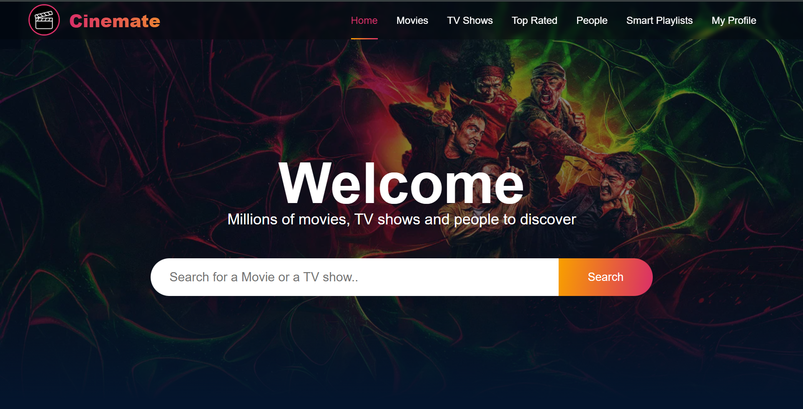
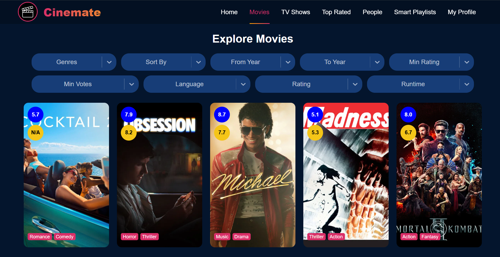
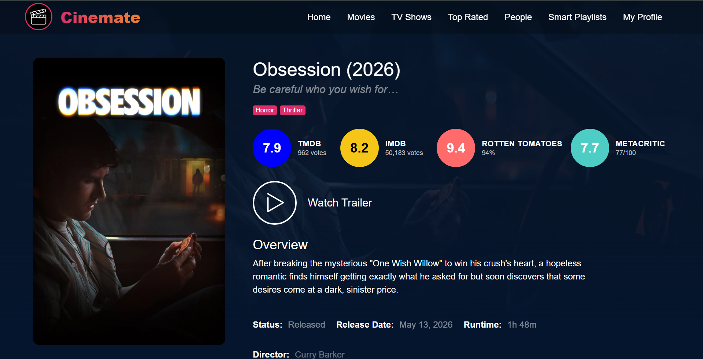
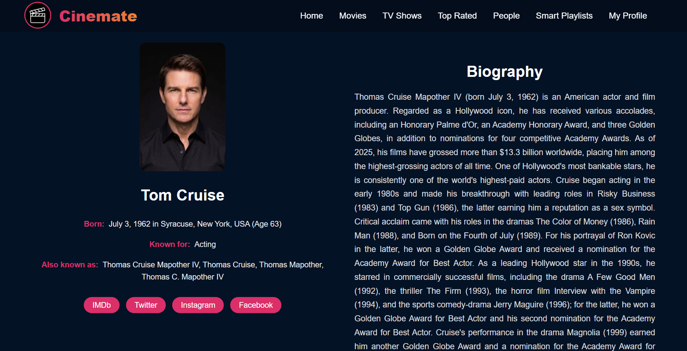
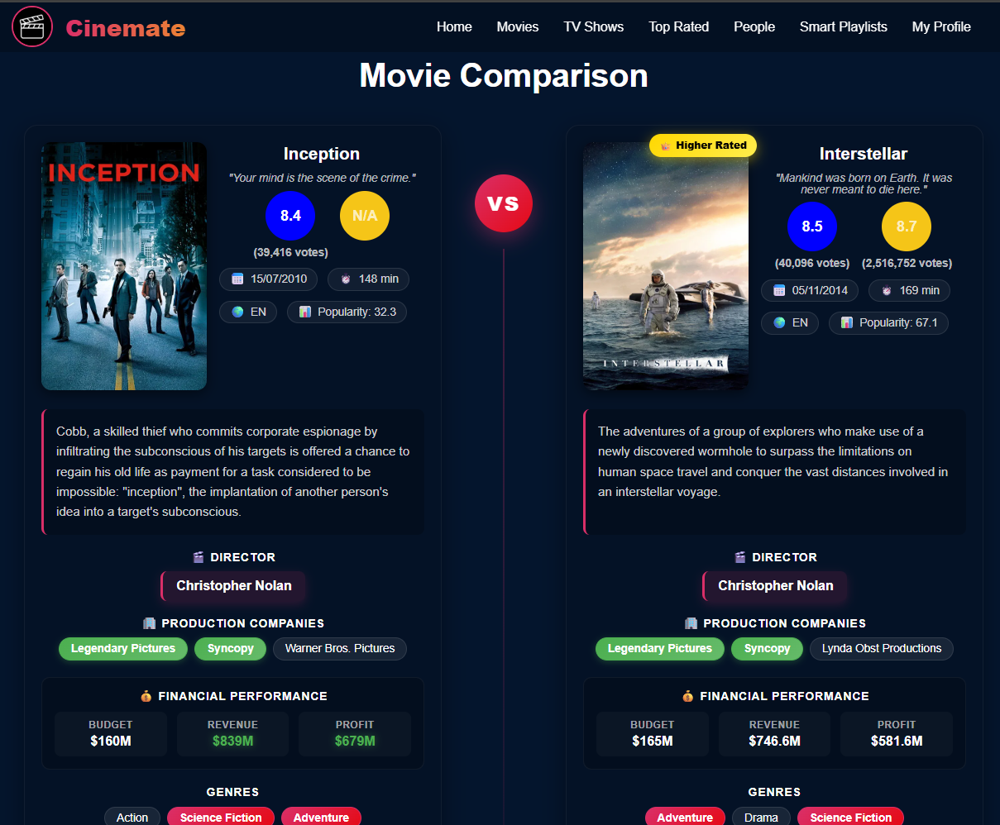
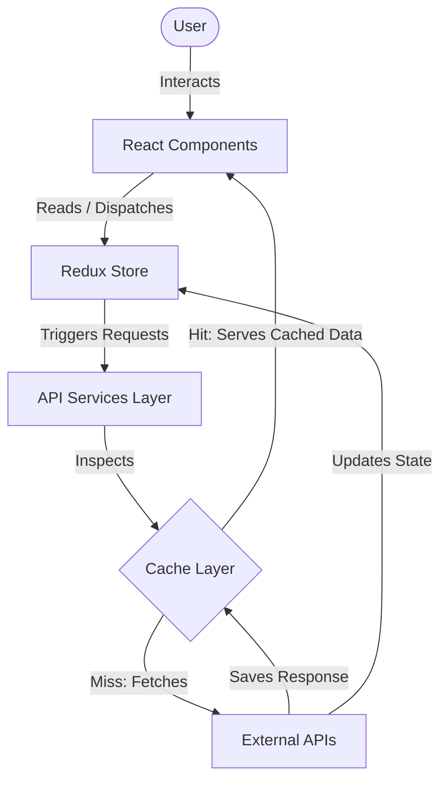

<h1 align="center">MyCinemateHub</h1>

  
  
  
  
  
  

  🔗 <b>Live Application</b>: <a href="https://mycinematehub.netlify.app" target="_blank" rel="noopener noreferrer">mycinematehub.netlify.app</a>

  MyCinemateHub is a movie and TV series discovery platform that allows users to explore titles, analyze cast and crew careers, view aggregated ratings and community opinions, discover personalized taste insights, check historical awards, browse soundtracks, compare titles side-by-side, calculate series binge times, and more.

---

<h2 align="center">📸 Screenshots</h2>

    
    
    
    
  

---

<h2 align="center">💡 Why MyCinemateHub?</h2>

Most movie platforms help you find content. MyCinemateHub helps you understand your relationship with cinema. 

Instead of just listing titles, it functions as a comprehensive product by combining:
* **Discovery**: Seamless browsing and search for movies and TV series.
* **Analytics**: Interactive, data-driven charts that map out user watch patterns and creator career trends.
* **AI Taste Modeling**: AI-assisted profiling of user viewing habits to explain their personal taste.
* **Community Opinions**: Community discussions and feedback aggregated from Reddit.
* **Streaming Availability**: Regional catalog lookups to show where titles can be streamed, rented, or bought.

### Tech Stack in Detail
To achieve this, the project uses a focused, high-performance tech stack:
* **UI & Component Layer**: Built with **React 18** and **Vite** for fast, modular rendering. Styled using **Sass (SCSS)** with structured mixins for fluid layouts, custom scrollbars, and glassmorphic components.
* **Global State & Cache Orchestration**: Powered by **Redux Toolkit** to synchronize user lists, watch history, and search states across components.
* **Generative Intelligence**: Powered by **Google Gemini 2.5 Flash** (via `@google/generative-ai`) for personalized taste analysis, custom recommendations, and AI-assisted search query correction.
* **Cinematic & Community Data**: Integrates data streams from **TMDb** (core metadata), **OMDb** (IMDb ratings), **Reddit API** (social discussions), **Wikidata SPARQL** (award registries), **MusicBrainz** (soundtracks), and **Wikiquote/Wikipedia** (dialogue and trivia).
* **Data Visualization**: Built with **Recharts** to generate interactive pie, bar, and area graphs.

---

<h2 align="center">🛠️ System Architecture & Data Flow</h2>

To ensure fast load times and clean separation of concerns, the application organizes data flow in a unidirectional pipeline:

### Unidirectional Data Flow:
1. **User Interaction**: The user interacts with React UI components (e.g., clicking a movie card, opening a profile, or typing a query).
2. **Component Layer**: React components read local state and dispatch actions to the Redux Store for globally shared states.
3. **Redux Store**: Acts as the single source of truth, organizing lists (Favorites, Watch Later, Watched) and global UI states.
4. **API Services Layer**: Manages outbound HTTP requests via Axios.
5. **Cache Layer**: Before making external requests for ratings or quotes, the services layer checks an in-memory cache (`Map`). On a hit, it immediately returns the data.
6. **External APIs**: On a cache miss, the app queries the respective third-party API (Gemini, TMDb, OMDb, Reddit, Wikidata, MusicBrainz, Wikipedia, Wikiquote, YouTube), saves the response to the cache layer, and updates the Redux store to trigger a re-render.

---

<h2 align="center">🤖 Artificial Intelligence (AI) Integration</h2>

Google Gemini API (using the `gemini-2.5-flash` model) is integrated into the application to power personalized insights and improve search accuracy:

### 1. Personal Taste Profiler (Profile Page)
* **History Evaluation**: When a user requests insights, the app compiles the user's watch data from favorites, watchlists, and watched titles and sends it to the Gemini API.
* **Taste Summary**: The AI generates a custom, multi-sentence narrative summary of the user's movie and TV tastes.
* **Taste Metrics**: Gemini analyzes and outputs structured profile metadata:
  * **Vibes**: Identifies style themes (e.g., "mind-bending", "dark & gritty", "cozy").
  * **Pacing & Diversity**: Estimates preferred pacing (slow-burn, balanced, fast-paced) and rates the user's genre diversity (narrow, mixed, broad).
  * **Creator Leanings**: Highlights specific directors and actors the user frequently watches.

### 2. AI-Assisted Search Query Correction (Search Bar)
* **Spelling Auto-Correction**: When a user inputs a query in the search bar, the app uses Gemini to analyze the text. It automatically detects and corrects any spelling mistakes or typos in movie titles, show names, or actor names before sending the query to the TMDb database. This ensures users find the correct content even with imperfect inputs.

---

<h2 align="center">📖 Detailed Page Breakdown</h2>

### 1. Home Page
A multi-section dashboard presenting various angles of content discovery:
* **Interactive Hero Banner**: Features a search bar overlaid on random high-resolution backdrops from trending titles.
* **Trending & Popular Sections**: Displays sliding carousels of top-trending and popular movies and shows, complete with toggle tabs to switch media types.
* **Award Winners**: Prominently displays critically-acclaimed titles that have won major historical cinematic awards.
* **Streaming Watch Providers**: Integrates local streaming platform hubs (e.g., Netflix, Prime Video, Disney+) directly on the homepage for quick access.
* **Coming Soon**: Showcases upcoming releases with countdown parameters to build user anticipation.
* **Movie Collections**: Curated film sets and franchise groupings (e.g., trilogies and cinematic universes).
* **Latest Videos & Trailers**: A video gallery displaying the newest official trailers, teasers, and clips.
* **Top Rated**: Showcases the highest critically-acclaimed titles in the database.
* **Movie Length (Runtime Categories)**: Categorizes and displays films based on their running times (e.g., short films, standard duration, and long epics).
* **Movies by Year**: Allows users to explore and browse historical film catalogues organized by specific release years.

### 2. Explore Page
A comprehensive directory for searching and filtering content:
* **Advanced Filters**: Dropdowns to filter by multiple genres, release dates, and sorting options (e.g., popularity, rating, release date).
* **Infinite Scroll**: Utilizes infinite scrolling to load more content automatically, keeping the DOM light and performance smooth.
* **Dual Categories**: Dedicated explore sections for both movies and TV series.

### 3. Movie & TV Details Page
A comprehensive hub for a single title, integrating several specialized components:
* **Consolidated Ratings**: Aggregates and displays scores from **TMDb**, **IMDb**, **Rotten Tomatoes**, and **Metacritic** on a single panel.
* **Memorable Quotes**: Pulls iconic, authentic dialogue from the **Wikiquote API** (cached locally for faster load times).
* **Wikipedia Trivia**: Extracts production facts, trivia, and easter eggs through Wikipedia APIs.
* **Enriched Awards**: Displays major wins (Oscars, Golden Globes, Emmys) by combining OMDb summaries with real-time **Wikidata SPARQL** background queries.
* **International Release Dates**: Displays a searchable, paginated list of release dates and ratings across different countries from TMDb.
* **Soundtracks & Songs**: Connects to the **MusicBrainz API** to show the official soundtrack tracklist and song lengths.
* **TV Series Binge Calculator**: Calculates the total running time of a TV series across all episodes and seasons, and estimates how long it takes to binge at different speeds (1x, 1.25x, 1.5x, 2x).

### 4. Person (People) Page
A dedicated profile for actors, directors, and crew members:
* **Biography & Media**: Full biographical details, birth/death dates, age calculator, and high-resolution photo galleries.
* **Career Analytics**: Automatically calculates career metrics from the person's TMDb credits:
  * **Career Span**: First work, most recent work, and total active years.
  * **Success Rate**: The percentage of their filmography rated 7.0 or higher.
  * **Genre & Active Decade Trends**: Identifies their most successful genres and most active decade.
  * **Actor Character Types**: Evaluates common character roles they have played (e.g., detecting if they frequently play "detective", "villain", or "hero").
* **Deterministic Career Timeline**: An algorithmically generated chronological career timeline built directly on the client side using TMDb credits data:
  * **Career Debut**: Identifies and highlights their earliest project.
  * **Global Blockbuster (Peak Popularity)**: Calculates and highlights their most popular project.
  * **Critical Peak**: Highlights their highest-rated project (with a threshold of over 100 votes for accuracy).
  * **Behind-the-Scenes Transition**: Tracks their transition to director, writer, or producer if they worked behind the camera.

### 5. Profile & User Dashboard
A personalized dashboard showcasing user habits and lists:
* **List Management**: Quick tabs to view and manage user lists (Favorites, Watchlist, and Watched history).
* **Statistics Section (Recharts)**: Visualizes user watching trends and analytics:
  * **Genre Distribution**: Pie charts showing the user's favorite genres.
  * **Watch Time Trends**: Breakdown of hours watched, release year distributions, and ratings.
* **AI-Powered Insights Dashboard**: Contains the Gemini-powered taste profile summary and the custom recommendations carousel.

### 6. Comparison Pages (Movie & TV)
Enables side-by-side analysis of multiple titles:
* **Statistical Comparison**: Renders comparison charts (using Recharts) of ratings, runtimes, and budgets.
* **Detail Matrix**: Compares genres, release dates, casts, and platforms side-by-side to help users decide what to watch.

### 7. Watch Providers Page
* **Stream/Rent/Buy Directory**: Queries regional streaming catalogs to show users where they can watch, rent, or buy titles in their country.

---

<h2 align="center">🔌 Third-Party API Integrations</h2>

1. **TMDb (The Movie Database) API**: Core movie/TV metadata, cast details, trending lists, and images.
2. **OMDb (Open Movie Database) API & IMDb**: Aggregated rating scores (IMDb, Rotten Tomatoes, Metacritic).
3. **Reddit API**: Integrates community discussions and reviews from movie subreddits.
4. **Wikidata SPARQL API**: Background queries for detailed historical award win records.
5. **MusicBrainz API**: Soundtrack album releases and tracklistings.
6. **Wikiquote & Wikipedia APIs**: Retrieves movie quotes and production trivia, providing users with contextual, encyclopedic details.
7. **Google Gemini API**: Generative AI personalized user taste profile analytics, recommendations, and search spelling correction.
8. **YouTube**: Official trailer playback via embedded player.

---

<h2 align="center">⚡ Performance Optimizations</h2>

### 1. Dual Ratings & Quotes Cache
To prevent API rate-limiting and improve speed, the app caches ratings and quotes in a JavaScript `Map`. Cached items are returned instantly, cutting down duplicate network requests.

### 2. Image Lazy Loading
Uses `react-lazy-load-image-component` to defer loading posters and backdrops until they enter the viewport, saving network bandwidth and keeping scroll performance smooth.

---

<h2 align="center">📊 Data Sources Note</h2>

MyCinemateHub aggregates information from:
* **TMDb**: Movie and TV series metadata, casting information, and media assets.
* **OMDb**: Multi-platform ratings (IMDb, Rotten Tomatoes, Metacritic).
* **Reddit**: Community discussions and reviews.
* **Wikidata**: Verified historical awards records (via SPARQL).
* **MusicBrainz**: Soundtrack albums and tracklists.
* **Wikipedia & Wikiquote**: Production trivia, fun facts, and dialogue quotes.

*Note: Data availability and detail depth depend on third-party API coverage and uptime.*
